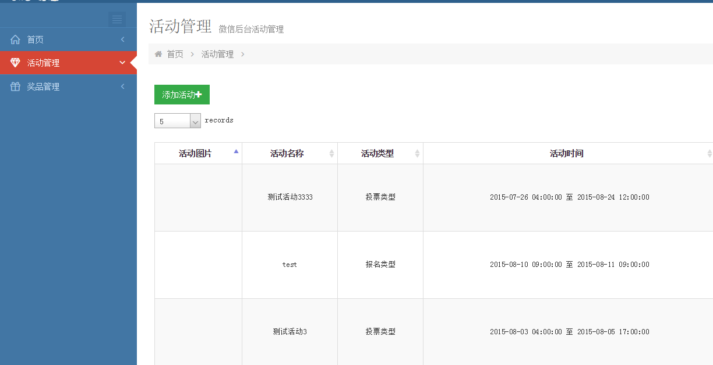

---------------------------------
wxadm是一个微信活动发布后台管理系统，可以作为基础框架使用。  

# wxadm

------

**wxadm**是一个微信活动发布后台管理系统，可以作为基础框架使用。

#### wxadm技术使用

> * <spring.version>4.1.4.RELEASE</spring.version>
> * <mybatis.version>3.2.8</mybatis.version>
> * <mybatis-spring.version>1.2.2</mybatis-spring.version>

前端使用基于bootstrap的Metronic框架，[Metronic](http://themeforest.net/item/metronic-responsive-admin-dashboard-template/4021469)是专门用户后台管理的bootstrap框架，因为加载的css和js比较多，所以大多用于后台。[Metronic在线演示](http://www.yyyweb.com/demo/metronic-bootstrap/index.html)。  
效果如下图：
  

------

## 使用步骤
> * 1、git clone git@github.com:picnic106/wxadm.git
* 2、在MySQL中导入 \src\main\resources\wxadm.sql 脚本
* 3、更新 wxadm/src/main/resources/config.properties 中 的数据库信息
* 4、本项目使用maven开发，使用之前请检查是否安装了maven
* 5、我是使用的idea开发，使用maven很方便，开发工具，请自行选择。

## 在IDE 中查看源码并运行
> #### 1 、在IntelliJ IDEA
* File -> Import Project -> select wxadm folder -> create project form existing sources -> ...